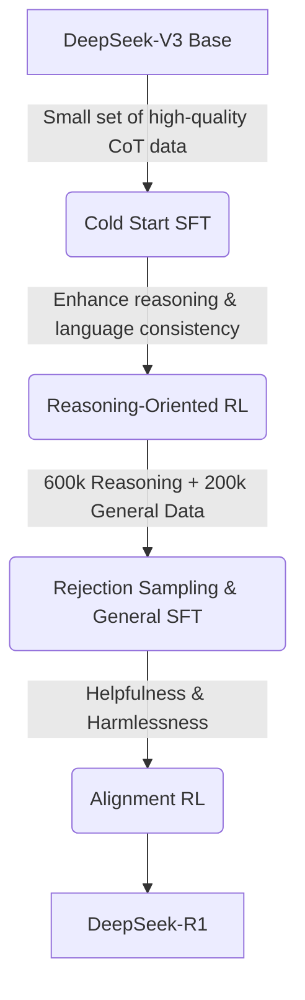

# Metadata
- **Title**: DeepSeek-R1: Incentivizing Reasoning Capability in LLMs via Reinforcement Learning
- **Authors**: DeepSeek-AI
- **Publication Date**: January 2025
- **Source**: Local PDF (`~/Documents/DeepSeek-R1-v2.pdf`)

# Summary

The paper demonstrates that advanced reasoning capabilities in Large Language Models (LLMs) can be developed primarily through Reinforcement Learning (RL), minimizing the need for extensive human-annotated reasoning data.

## Core Concepts

*   **Emergent Reasoning via Pure RL**: The researchers developed **DeepSeek-R1-Zero** using pure RL without prior Supervised Fine-Tuning (SFT). By simply rewarding correct final answers, the model naturally developed sophisticated problem-solving behaviors, including self-reflection, verification, and dynamic strategy adaptation.
*   **Group Relative Policy Optimization (GRPO)**: The underlying RL algorithm utilized. GRPO simplifies the training process by eliminating the need for a separate value model (unlike PPO), instead estimating advantages based on group scores. This significantly reduces memory overhead.
*   **Addressing Readability**: DeepSeek-R1-Zero struggled with language mixing and poor readability. To resolve this, the authors created **DeepSeek-R1** using a multi-stage pipeline that incorporates limited SFT alongside RL to align the model with human formatting preferences while preserving reasoning strength.
*   **Distillation**: The reasoning patterns learned by the massive DeepSeek-R1 model were distilled into smaller open-weight models (based on Llama and Qwen architectures, ranging from 1.5B to 70B parameters), yielding significant performance gains for smaller architectures without requiring large-scale RL.

## Training Pipeline for DeepSeek-R1

To help you visualize the process, here is the structured evolution used to create the final DeepSeek-R1 model from its base:

## Performance

*   DeepSeek-R1 achieves performance on par with closed-source frontier reasoning models (such as OpenAI's o1-1217) across major reasoning benchmarks, including AIME 2024, MATH-500, and Codeforces.
