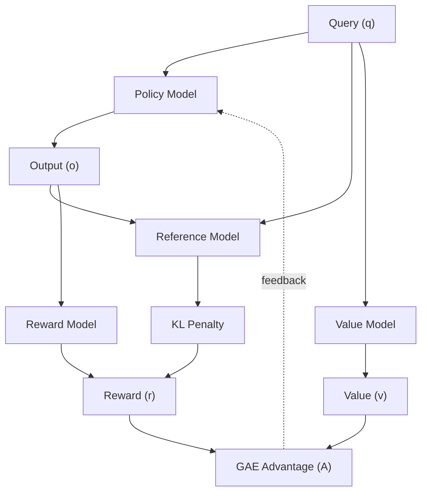
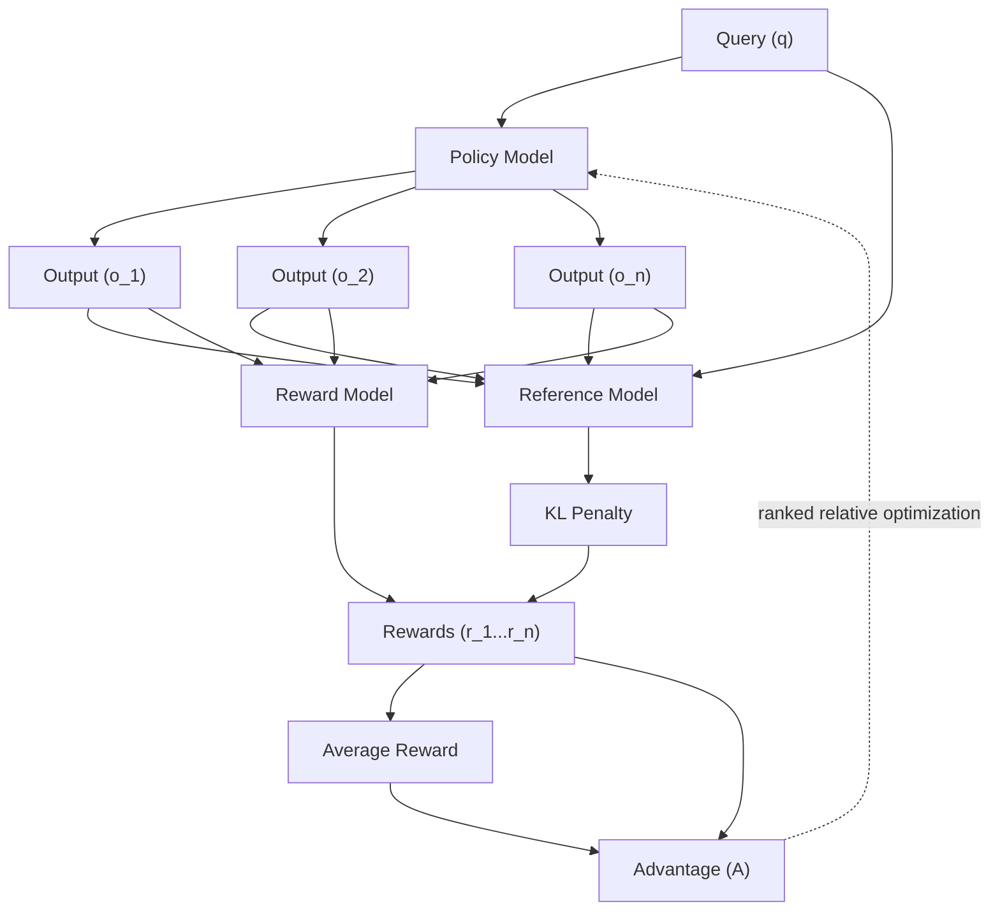

- Source: <https://www.youtube.com/watch?v=dGoxEpoacy0>
- Author: [[Adam Lucek]]
- Related: [[Videos]]

---

## Summary

# I Trained an LLM to Think Deeper (Here’s How)

**Key Insights & Takeaways**

- **Reinforcement learning ([[RL]]) is the core of deeper LLM reasoning** – the speaker demonstrates that a well‑structured policy‑gradient approach can produce human‑like, multi‑step reasoning when applied to a large language model.

- **PPO for context framing** – the policy‑gradient algorithm used is Proximal Policy Optimization (PPO). By feeding the model a _prompt + contextual reward signal_, PPO learns to prioritize more accurate, multi‑headed responses.

- **GRPO – The “Guided RPO” algorithm** – an extension of PPO that adds a _guidance loss_ to keep the model’s policy close to a set of “expert demonstrations” (e.g., human‑generated reasoning traces). This prevents drift and speeds up convergence.

- **DeepSeek‑R1 training pipeline** – a zero‑shot pre‑training of a policy network that is then fine‑tuned with GRPO. It consists of:
  1. **Model loading** – load a large transformer (e.g., Qwen‑2.5‑3B‑Instruct) as the base.
  2. **Dataset preparation** – construct a faithful, curated set of question‑answer pairs with multi‑step reasoning traces.
  3. **Reward specification** – use a reward function that rewards correct chain‑of‑thought steps and penalizes hallucinations.
  4. **GRPO trainer** – the PPO loop with guidance loss, trained for several million steps.

- **Practical performance** – the fine‑tuned model shows a marked improvement in “think‑deeper” tasks, achieving higher accuracy on benchmarks like GSM‑8K and the new DeepSeek‑R1 tasks.

- **Implementation resources** – code (GitHub), the trained model (Hugging Face), and research papers (DeepSeek‑R1, DeepSeek‑Math). These provide a ready‑to‑run starter kit for anyone wanting to replicate or extend the results.

- **Takeaway for practitioners** – if you want a smarter LLM, spend time on RL‑based fine‑tuning rather than just supervised training. Use PPO/GRPO with a carefully crafted reward model to shape the policy.

- **Future directions** – explore sparse reward shaping, curriculum learning, or combining RL with retrieval‑augmented generation for even deeper reasoning.

**Short Recap**

| Stage                     | Action                                               | Why it Matters                                                |
| ------------------------- | ---------------------------------------------------- | ------------------------------------------------------------- |
| 1. Load base LLM          | Start with a solid foundation (Qwen‑2.5‑3B‑Instruct) | Provides the large parameter space for nuanced reasoning      |
| 2. Build dataset          | Curate high‑quality chain‑of‑thought examples        | Supplies the signal for RL to learn realistic reasoning paths |
| 3. PPO baseline           | Train policy gradient with context reward            | Gives the model the ability to self‑direct based on reward    |
| 4. Add GRPO guidance      | Constrain policy to stay near expert traces          | Prevents collapse and speeds up learning                      |
| 5. Evaluate on benchmarks | Measure depth of reasoning                           | Confirms that RL adds measurable reasoning improvements       |

---

**Bottom line:** Reinforcement learning, when carefully orchestrated via PPO and a guidance‑regularized variant (GRPO), can make a large language model _reason_ more deeply and accurately. The video provides both conceptual explanations and actionable code.

# Architecture

## PPO



## GRPO



## Notes

- [[PPO]]
  - high level review
  - starting with a Policy Model
    - policy in this case indicates the behavior of the model
  - q -> o
  - Reference Model - Reward Model -> KL penalty -> r
  - Value Model -> v
  - GAE -> A -> feedback
- [[GRPO]]
  - DeepSeek team modified PPO in various ways
  - inefficient to maintain a whole other value model
  - Value model helps when you care about intermediate steps
    - if you can compare final answer to ground truth you can do without
  - q -> multiple outputs o_n
  - Reference and Reward models
  - average reward
  - advantage calculated based on the difference of each reward to the average
  - then ranked rs, so you get optimization for relative ranking instead of
    absolute values
- How GRPO was applied
  - the algorithm taught the LLMs to think through problems longer without
    explicitly defining any functions that encourage reasoning or thinking length
  - DeepSeek began training using pure GRPO RL on DeepSeek-R1-Zero
    - base model DeepSeek-V3 LLM
    - prompt template
    - ````A conversation between User and Assistant. The user asks a question and
      the Assistant solves it. The assistant first thinks about the reasoning
      process in the mind and then provides the user with the answer. The
      reasoning process and answer are enclose within <think></think> and
      <answer></answer> respectively. User: *prompt* Assistant: ```
      ````
    - math, code, logic based questions
    - verifiable outcomes
- results
  - exhibit behavior of reflection, reevaluating prior steps
  - explore possible alternative methods
  - use more test-time compute and generate longer answer as it reflects and
    explore more possibilities
- full pipeline for DeepSeek-R1
  1. SFT with Long CoT examples
  - labeled reasoning from DeepSeek-Zero
  - Few Shot synthetic data generation
  - this develops the style, not the reasoning yet
  2. GRPO RL for Reasoning
  - coding, math, science, logic examples for verifiability
  - generate 800k examples non-reasoning specific data (writing, factual,
    translation, fuzzy examples)
  3. SFT for 2 epochs with these examples
  4. RL alignment
- with this they matched o1 with much less computer requirements
